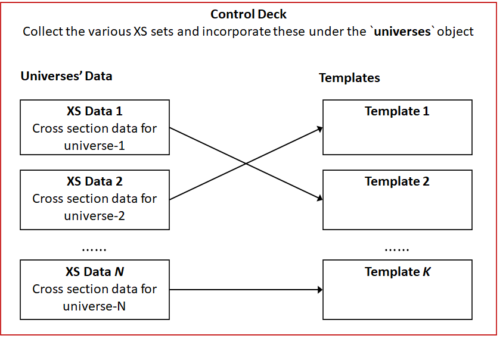

.. _user-manual:

User's Manual
=============

The User\'s Manual for the ``xsInterface`` package describes the 
various inputs required by the code and its various applications. 
The User\'s Manual also describes the printed output options as well as the embedded post-processing capabilities. 

Input examples are provided for the main applications to assist in the preparation of new problems.

The following table describes all the components needed to read, write, and process data.

========================= ============================================
Chapters							    Description
========================= ============================================
:ref:`universecards`	    Input cards necessary to define a universe/set
------------------------- --------------------------------------------
:ref:`templates`	        Setting rules-based user-defined template files 
------------------------- --------------------------------------------
:ref:`controldeck`		    Control the input-to-output data flow 
------------------------- --------------------------------------------
:ref:`codeexe`				    Execution of the code and data manipulation
------------------------- --------------------------------------------
:ref:`postprocess`				Post-processing of results
------------------------- --------------------------------------------
:ref:`dyn3d`				    	Application the ``xsInterface`` with the nodal diffusion code, DYN3D.
========================= ============================================

.. toctree::
   :maxdepth: 2
   :hidden:
   :caption: Contents:

   controldeck
   input_cards
   templates
   code_exe
   postprocess
   coerelabel
   general
   dyn3d
   example1_dyn3d

Data Flow
---------

The figure below is provided for explaining the data flow sequence.

1. Begin by defining all the universe files with cross-section data - including data read from external sources (e.g., Serpent).
2. Proceed with defining unique template files to be used to output the information.
3. Conclude the process with the control deck file that ties between universe and template files.

After these files are established, the code can be exectuted and data can be post-processed.

.. role:: underline
    :class: underline

	
