.. _dyn3d_example3:

Example 3: A Fuel-Moderator supercell
-------------------------------------

This Notebook demonestrates how to calculate correction factors (i.e.,
axial ADFs in this case) using the built-in JFNK procedure within the
``xsInterface`` package.

First, cross sections are read from a serpent ``_res.m`` file. This
notebook shows how to execute DYN3D iteratively using the ``Iterate``
method.

It is important to note that the solution presented here was validated
against a consistent semi-analytic solution (not presented here).

Case Description
----------------

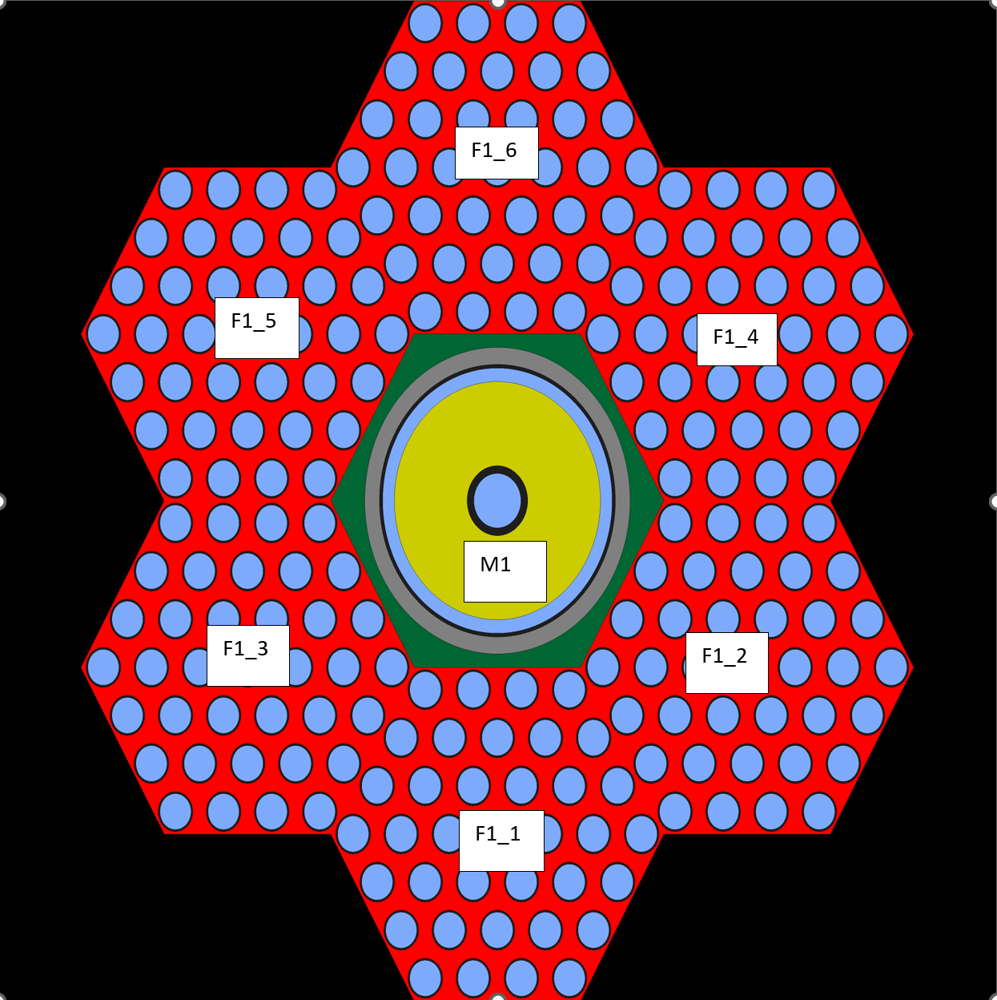

The ``.\inputs`` directory includes: -
:literal:`case1_lumped_big_res\` a serpent results file with all the cross sections. -`\ univs\ ``a file that describes how to read``\ case1_lumped_big_res.m\ ``-``\ template_dyn3d_2g_fuel\ ``is a template file that specifies how cross sections should be printed out for the fuel and moderator elements. -``\ controlDict\ ``the main files that is required by the``\ xsInterface`\`.

The ``.\dyn3d`` includes a pre-generated DYN3D case. The ``.\dyn3d\xs``
directory will include all the files with printed cross sections
required by DYN3D.

Required imports
~~~~~~~~~~~~~~~~

.. code:: 

    from xsInterface.functions.main import Main

.. code:: 

    # a class required to execute DYN3D
    from xsInterface.functions.dyn3d import DYN3D

.. code:: 

    inputFile = ".\\inputs\\controlDict"

Read the cross sections
~~~~~~~~~~~~~~~~~~~~~~~

.. code:: 

    # Reset the main object
    xs = Main(inputFile)

.. parsed-literal::

    ... Reading control dict ...
    <.\inputs\controlDict>
    
    

Read xs data without populating the templates
^^^^^^^^^^^^^^^^^^^^^^^^^^^^^^^^^^^^^^^^^^^^^

.. code:: 

    # readTemplate allows to read and populate data using the templates
    xs.Read(readUniverses=True)

.. parsed-literal::

    SERPENT Serpent 2.1.32 found in ./serpent/case1_lumped_big_res.m, but version 2.1.31 is defined in settings
      Attemping to read anyway. Please report strange behaviors/failures to developers.
    

.. parsed-literal::

    ... Reading universe <u> ...
    ... Reading coe/_res.m file for hisotry <nom> ...
    

Populate cross sections
~~~~~~~~~~~~~~~~~~~~~~~

In the ``".\\inputs\\controlDict"`` the user defined the core map used
to populate the cross sections according to their channels and layers
positions.

In our problem we have 1 channel and 38 axial layers.

**Define states** These states must exist and be used to obtain the
cross sections for different channels and layers.

.. code:: 

    nchs = 2
    nlayers = 1
    states = {
    'history':[['nom']*nlayers]*nchs,
    'time': [[0.0]*nlayers]*nchs,
    'dens': [[700.]*nlayers]*nchs,
    }

**Populate core data** built-in capability to populate the data
according to the defined map including defining new variables not listed
in the original ``univs`` file. This is a **mandaory** step if the
intent is to execute DYN3D.

.. code:: 

    volmanip = {'infflx': 'divide'}
    xs.PopulateCoreData(
                        states=states, 
                        attributes=None,  # specify only if specific attrs needed
                        volManip=volmanip,
                        adf=None, bottomadf=None, topadf=None, sph=None,)

Iteratively execute DYN3D
~~~~~~~~~~~~~~~~~~~~~~~~~

.. code:: 

    casedir = ".\\dyn3d"   # dyn3d dir
    casefile = "case1"  # name of dyn3d file
    exefile = "RUN_DYN3D" # dyn3d executuin file
    
    # Reset the object
    reslt = DYN3D(xs, casedir, casefile, exefile)

**Set the refernce flux**

.. code:: 

    refFlx = xs.core.corevalues['infflx']

**Execute**

The files will be written to the specified directories and then
automatically executed.

.. code:: 

    reslt.Iterate(
        corrattrs=['adf'], refFlx=refFlx, newtonIters=5, krylovSpan=10,
        krylovErr=5E-05, newtonErr=1E-07,
        dampingF=0.8, lbound=0.5, ubound=1.5, pert=5E-03)

.. parsed-literal::

    ... Iterative JFNK ...
    Newton #0/5
    Arnoldi # 1(1.78e-03/1.80e-03) 2(1.80e-04/9.11e-04) 3(4.70e-15/2.80e-03)
    Newton #1/5
    Arnoldi # 1(5.22e-04/5.48e-04) 2(1.81e-04/2.53e-04) 3(7.66e-17/2.05e-04)
    Newton #2/5
    Arnoldi # 1(9.15e-05/7.23e-05) 2(5.78e-06/4.70e-05) 3(7.60e-16/5.34e-05)
    Newton #3/5
    Arnoldi # 1(3.49e-05/3.50e-05) 2(2.94e-05/1.82e-05) 3(1.66e-17/1.82e-05)
    Newton #4/5
    Arnoldi # 1(1.70e-05/1.78e-05) 2(1.62e-05/1.18e-05) 3(3.56e-17/1.18e-05)
    

Compare results against Serpent
~~~~~~~~~~~~~~~~~~~~~~~~~~~~~~~

Plot the results for flux and its corresponding difference. Finally,
plot the convergence as a function of newton iteration number.

.. code:: 

    import numpy as np
    reslt.PlotFluxes([0], iters=np.array([0, 2, 4]),  markers=['<', '*', 'o'], chId="S2")

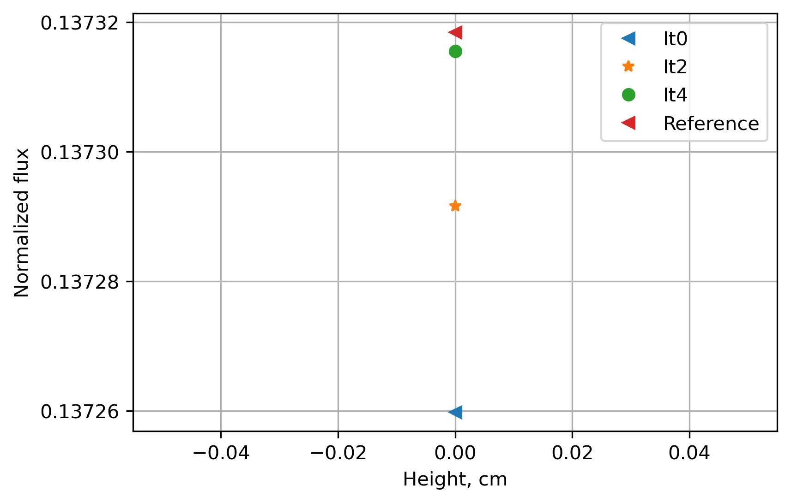

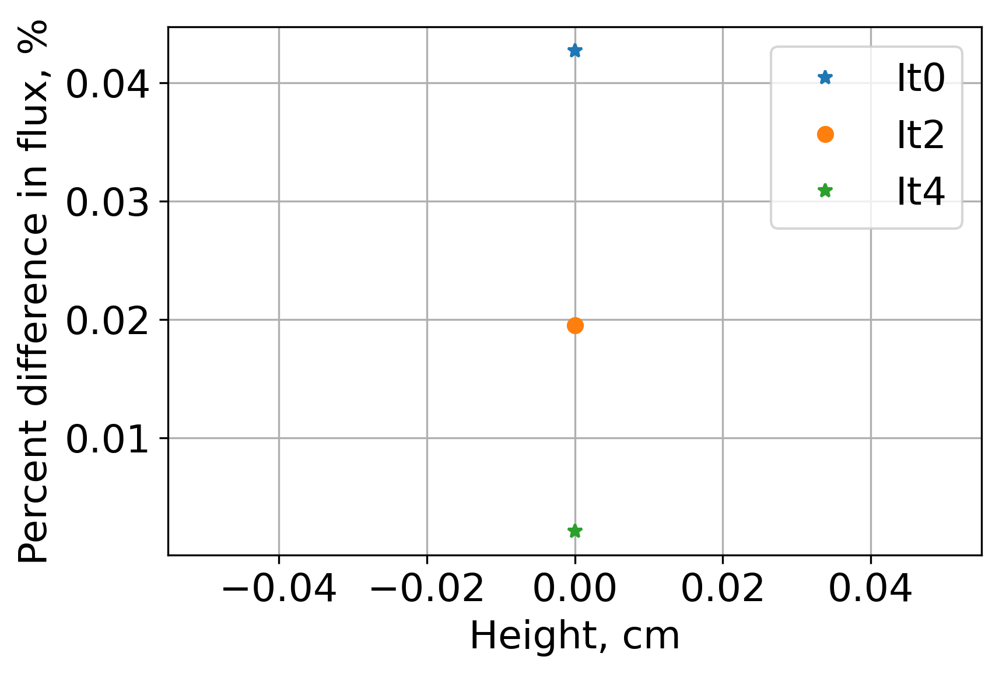

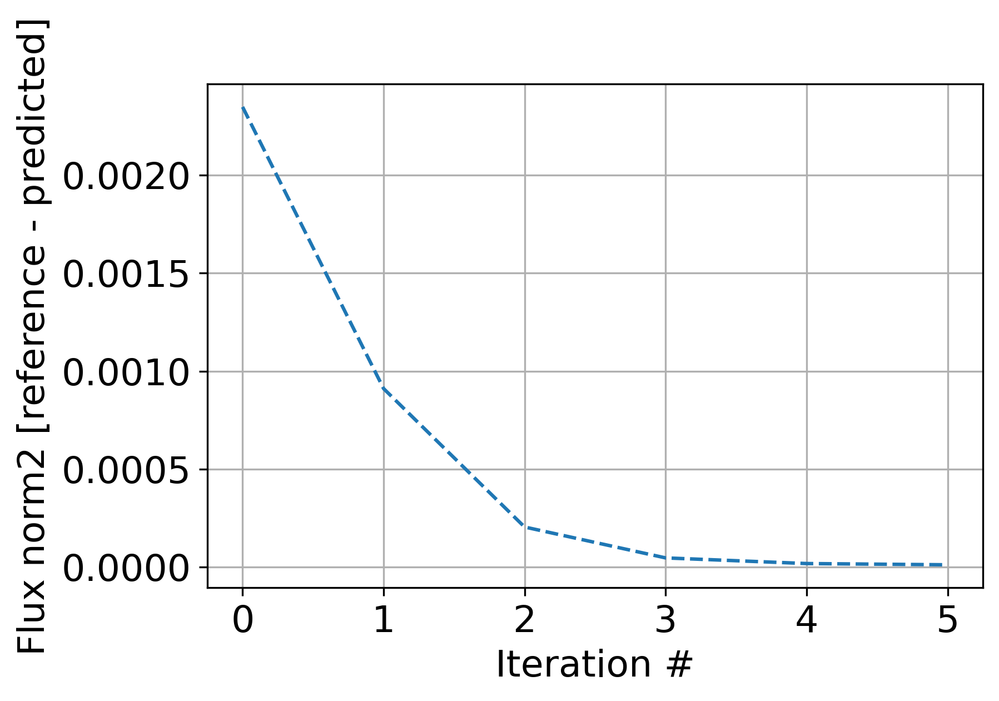

**Plot the reference fluxes in the Fast group and Thermal group
respectively**

.. code:: 

    xs.SlicePlot(reslt.refFlx, layer=0, markersize=3000, spacesize=2.0,
                  textsize=8, textcolor='w', textweight="bold", 
                  precision=".5f", edge=1.5, norm=10.0, label="Normalized fast flux", 
                  egroup=0, geomarker='h', shift=[-0.5, 0, -0.5])
    xs.SlicePlot(reslt.refFlx, layer=0, markersize=3000, spacesize=2.0,
                  textsize=8, textcolor='w', textweight="bold", 
                  precision=".5f", edge=1.5, norm=10.0, label="Normalized fast flux", 
                  egroup=1, geomarker='h', shift=[-0.5, 0, -0.5])
    

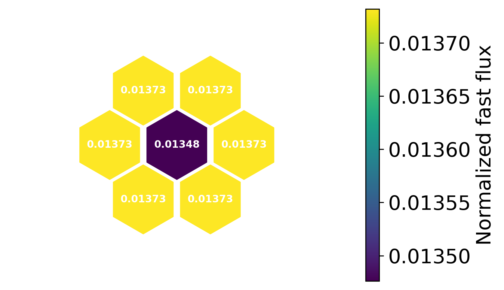

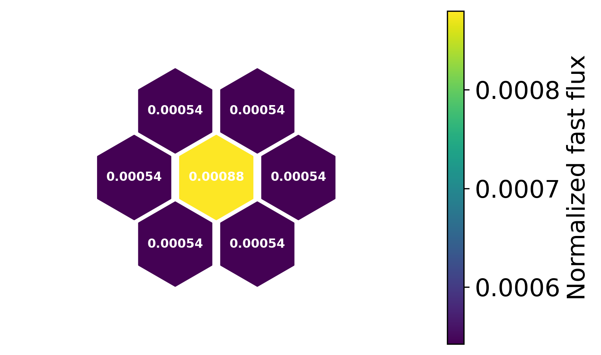

**Plot the flux differences in the Fast group and Thermal group
respectively** Without iterating on ADFs.

.. code:: 

    xs.SlicePlot(reslt.iterDifferences[0], layer=0, markersize=3000, spacesize=2.0,
                  textsize=8, textcolor='w', textweight="bold", 
                  precision=".2f", edge=1.5, norm=1.0, label="% Diff gr-1 (no Corrections)", 
                  egroup=0, geomarker='h', shift=[-0.5, 0, -0.5])
    xs.SlicePlot(reslt.iterDifferences[0], layer=0, markersize=3000, spacesize=2.0,
                  textsize=8, textcolor='w', textweight="bold", 
                  precision=".2f", edge=1.5, norm=1.0, label="% Diff gr-1 (no Corrections)", 
                  egroup=1, geomarker='h', shift=[-0.5, 0, -0.5])

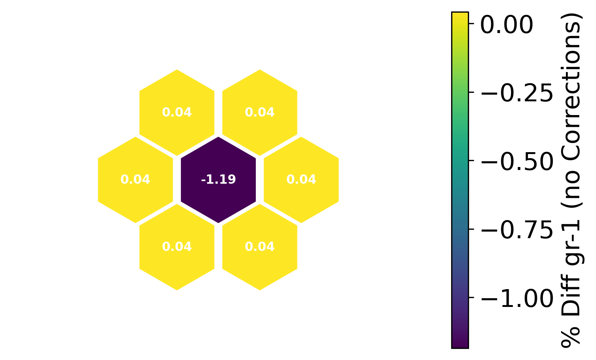

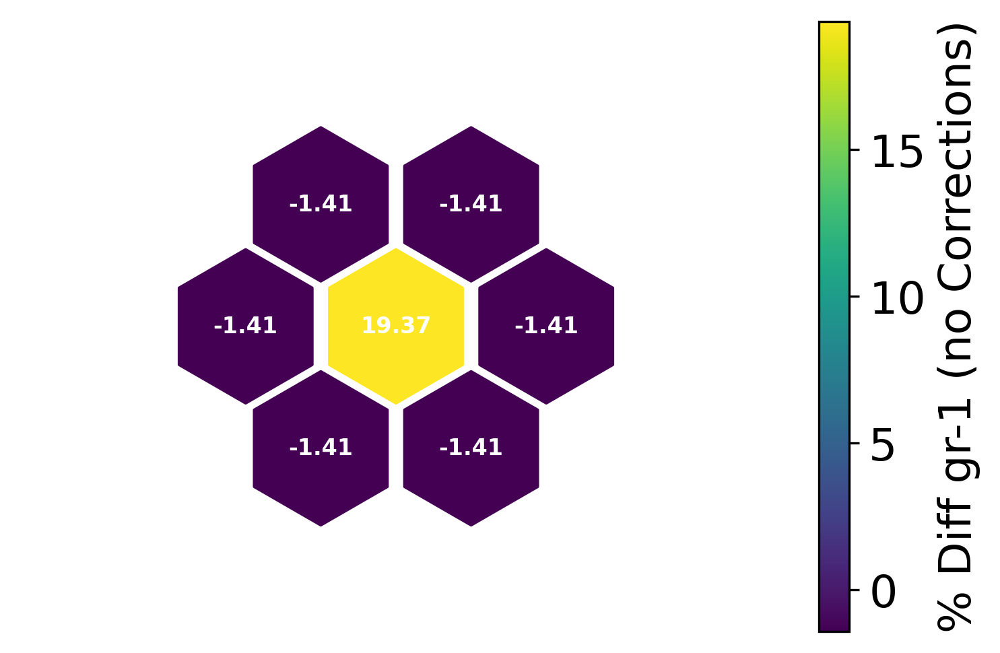

**Plot the flux differences in the Fast group and Thermal group
respectively** After iterating on ADFs.

.. code:: 

    xs.SlicePlot(reslt.iterDifferences[-1], layer=0, markersize=3000, spacesize=2.0,
                  textsize=8, textcolor='w', textweight="bold", 
                  precision=".2f", edge=1.5, norm=1.0, label="% Diff gr-1 (with Corrections)", 
                  egroup=0, geomarker='h', shift=[-0.5, 0, -0.5])
    xs.SlicePlot(reslt.iterDifferences[-1], layer=0, markersize=3000, spacesize=2.0,
                  textsize=8, textcolor='w', textweight="bold", 
                  precision=".2f", edge=1.5, norm=1.0, label="% Diff gr-1 (with Corrections)", 
                  egroup=1, geomarker='h', shift=[-0.5, 0, -0.5])

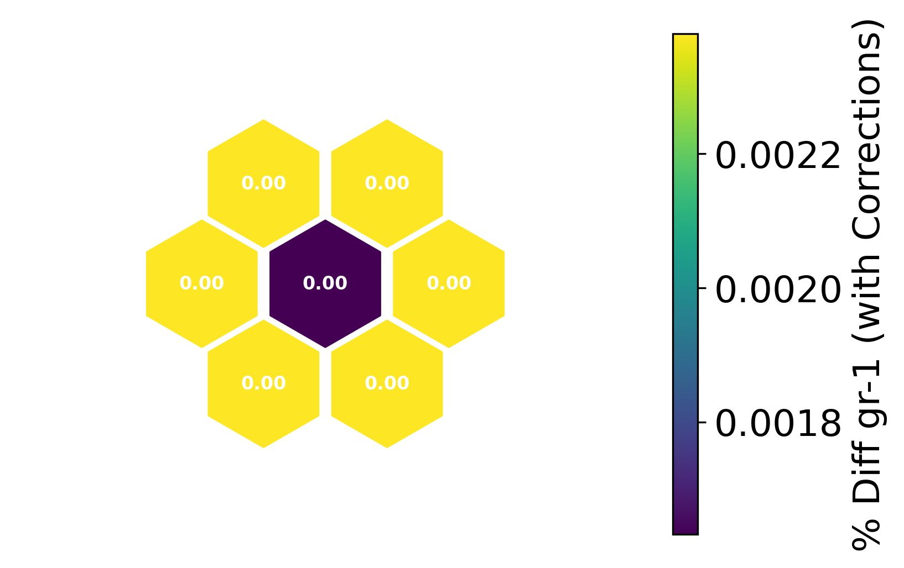

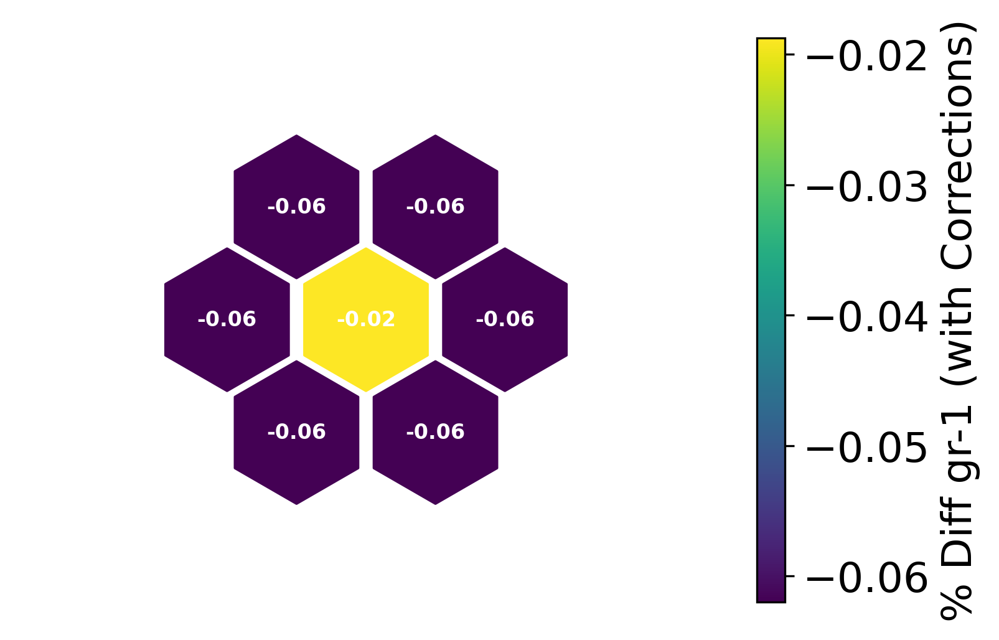

**Plot the resulting ADFs in the Fast group and Thermal group
respectively**

.. code:: 

    xs.SlicePlot(reslt.iterInputs['adf'][-1], layer=0, markersize=3000, spacesize=2.0,
                  textsize=8, textcolor='w', textweight="bold", 
                  precision=".4f", edge=1.5, norm=1.0, label="ADFs gr-1", 
                  egroup=0, geomarker='h', shift=[-0.5, 0, -0.5])
    
    xs.SlicePlot(reslt.iterInputs['adf'][-1], layer=0, markersize=3000, spacesize=2.0,
                  textsize=8, textcolor='w', textweight="bold", 
                  precision=".4f", edge=1.5, norm=1.0, label="ADFs gr-2", 
                  egroup=1, geomarker='h', shift=[-0.5, 0, -0.5])
    

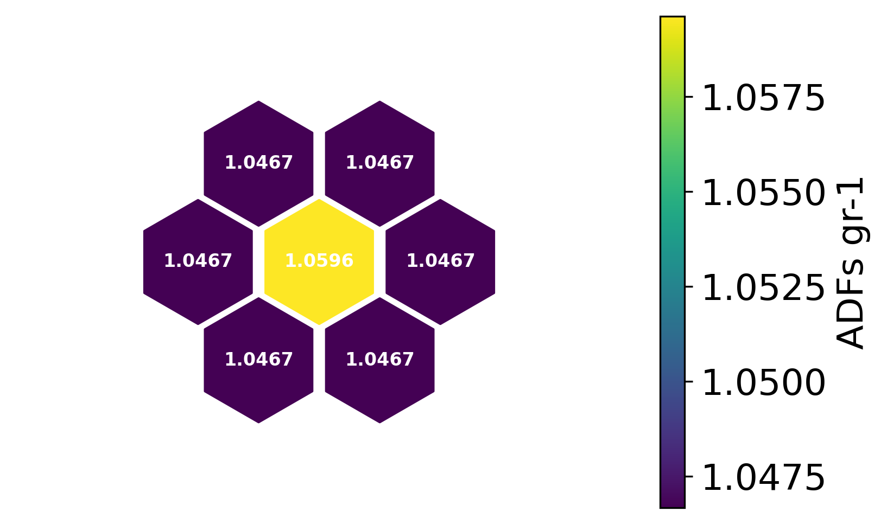

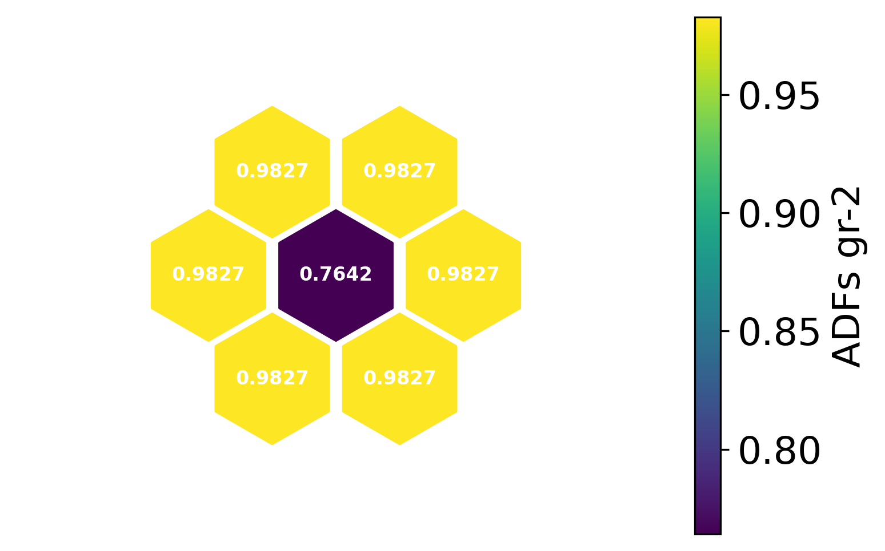

