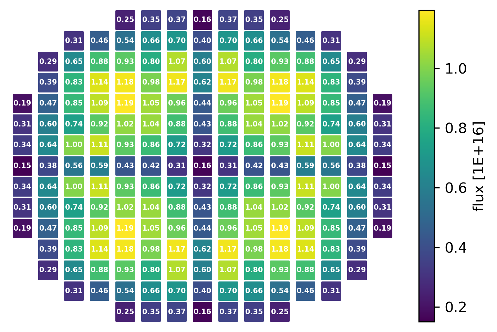
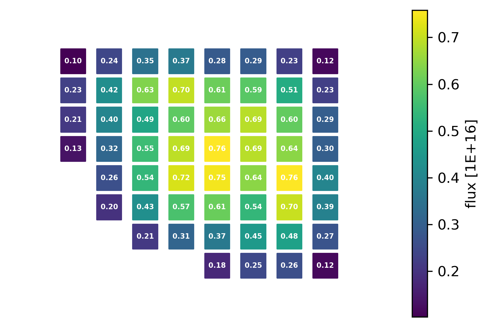

.. _postprocess:

Post process
------------ 

After the execution of ``xs.Read()``, the data can be directly obtained by using multiple methods.

========================= ============================================
Method							   		 Description
========================= ============================================
:ref:`p_table`			      Values presented in a table (pandas) format
------------------------- --------------------------------------------
:ref:`p_values`	          Values presented in a dictionary format.
------------------------- --------------------------------------------
:ref:`p_corevalues`	 			Values for radial channels & layers
------------------------- --------------------------------------------
:ref:`p_sliceplot`	 			Plot radial selected property distribution
========================= ============================================

.. _p_table:

=========
Table
=========

**Obtain values for a single universe and multiple parameters/attributes in a table format**.

**Syntax:**

.. code::

	xs.Table(univId, attrs, **kwargs)
		
where,

- ``univId`` is the universe name. Only a single universe string is allowed to be used.
- ``attrs`` is a list or string containing the parameters of interest.
- ``kwargs`` represent the different states (i.e., branches, history, time) for which data is obtained.

**Example:**

.. code::

	xs.Table("u0", ['inf_rabs', 'beta'], fuel=1500)
	
or

.. code::

	xs.Table("u0", 'beta', fuel=1500, mod=600, time=0.0, history='nom')

.. _p_values:

=========
Values
=========

**Obtain values for a single universe and single attribute in a dictionary format.**

**Syntax:**

.. code::

	xs.Values(univId, attr, **kwargs)
	
where, the parameters are identical to the ones used by the ``Table`` method, but the ``attr`` that can only be a single string describing a single attribute. 
	
**Examples:**

.. code::

	xs.Values("u0", 'inf_rabs', fuel=1500)
	
or

.. code::

	xs.Values("u0", 'beta', fuel=1500, mod=600, time=0.0, history='nom')

.. _p_corevalues:

===========
CoreValues
===========

**Obtain values for multiple attributes and all channels & layers.**

This method returns a dictionary with keys representing attributes
and values that are 2-dim lists representing values across
all channels and layers.

**Syntax:**

.. code::

	xs.CoreValues(attrs, chIds=None, volManip=None, **kwargs)
	
where,

- ``attrs`` is string or list of strings. Name/s of the attribute/s.
- ``chIds`` is a list of strings. List with all the channel names. If None, the results for all the channels are provided.
- ``volManip`` is a string or list of strings. Volume manipulation that be: 'multiply' or 'divide' or None. Default is None. If this is a list then the number of components must equal to the number of attributes. 
- ``kwargs`` represent the different states (i.e., branches, history, time) for which data is obtained.
- ``kwargs`` is named arguments. keys represent the state/branch name and value represent the values

	
**Examples:**

.. code::

	xs.CoreValues(['infkappa', 'infsp0'], 
	             chIds=['S1', 'S2', 'S3', 'S4'], 
	             volManip=None, 
	             history=[['nom', 'nom', 'nom', 'nom']]*4,
	             time=[[0.0, 0.0, 0.0, 0.0]]*4, 
	             fuel=[[900, 900, 900, 900]]*4, 
	             boron=[[0, 0, 0, 0]]*4,
	             dens=[[700, 700, 700, 700]]*4)
	
or

.. code::

	xs.CoreValues('infflx', 
	             chIds=None, 
	             volManip='divide', 
	             history=[['nom', 'nom', 'nom', 'nom']]*4,
	             time=[[0.0, 0.0, 0.0, 0.0]]*4, 
	             fuel=[[900, 900, 900, 900]]*4, 
	             boron=[[0, 0, 0, 0]]*4,
	             dens=[[700, 700, 700, 700]]*4)

or

.. code::

	xs.CoreValues(['infkappa', 'infsp0'], 
	             chIds=['S1', 'S2', 'S3', 'S4'], 
	             volManip=[None, 'multiply'], 
	             history=[['nom', 'nom', 'nom', 'nom']]*4,
	             time=[[0.0, 0.0, 0.0, 0.0]]*4, 
	             fuel=[[900, 900, 900, 900]]*4, 
	             boron=[[0, 0, 0, 0]]*4,
	             dens=[[700, 700, 700, 700]]*4)
	             
	             
	             
.. _p_sliceplot:

===========
SlicePlot
===========

**Plot radial property distribution for a given axial layer**

Please note that this plotting routine is only applicable after the values for all the channels and layers are obtained.
These value can be obtained using the ``CoreValues`` method.

*Inputs*:

-  ``values`` : 3-dim list. Values for all the channels, layers, and energy groups. 
-  ``chIds`` : identification strings of all the channels. 
-  ``layer`` : int index of the axial layer.
-  ``egroup`` : int index of the energy group.
-  ``radmap`` : 2-dim list of all the radial channels distribution. Default is None.
-  ``label`` : str description of the output variable. A default exist
   for every parameter.
-  ``shift`` : list of int shift rows by increments of 0.5 or 1
   (negative or positive)
-  ``norm`` : float data normalization factor
-  ``spacesize`` : float determines the space between elements
-  ``markersize`` : float hexagon/square/circles marker/shape size
-  ``cmap`` : str color map
-  ``text`` : bool flag to indicate if the text should be printed or not
-  ``textsize`` : float size of the text
-  ``textcolor`` : str color of the text
-  ``textweight`` : str font weight of the text
-	 ``edge`` : float number that creates edges in case some of the assemblies are cut. The larger is the number the more edge is created.
-  ``chnls2Ignore`` : str of channels to be ignored. If the string is even partially appears in the channels naming the channel results will not be presented.
-  ``includeRows`` : list with two integers marking the first row and the last row that are included in results presentation. None indicates that all rows are included.
-  ``includeCols`` : list with two integers marking the first column and the last column that are included in results presentation. None indicates that all column are included.

*Execute*
       

Plot the results

.. code:: 

    xs.SlicePlot(results['infflx'], layer=3, markersize=160, spacesize=60.0,
             textsize=5, chnls2Ignore='R', textcolor='w', textweight="bold", 
             precision=".2f", edge=2.0, norm=1E+16, label="flux [1E+16]")

.. code:: 

    xs.SlicePlot(results['infflx'], layer=15, markersize=300, spacesize=2.0,
             textsize=5, chnls2Ignore='R', textcolor='w', textweight="bold", 
             precision=".2f", edge=0.5, norm=1E+16, label="flux [1E+16]", 
             includeCols=[0, 8], includeRows=[0, 8])

**Remark**

It must be pointed out that the user is expected to generate the values and channels Ids and only then plot the results.

For example:

.. code:: 

	# get the channels Ids
	chIds=list(xs.core.chIds)
	nchs = len(chIds)
	nlayers = 22
	
	# obtain all the results and chIds correesponding to the results values
	results, chIds =\
	xs.CoreValues(['infnsf', 'infflx'], 
	              chIds=xs.core.chIds, 
	              volManip=None, 
	              history=[['nom']*nlayers]*nchs,
	              time=[[0.0]*nlayers]*nchs, 
	              dens=[[700.0]*nlayers]*nchs,)
	                
	# use the obtained results to plot data            
	xs.SlicePlot(results['infflx'], layer=15, markersize=300, spacesize=2.0,
               textsize=5, chnls2Ignore='R', textcolor='w', textweight="bold", 
               precision=".2f", edge=0.5, norm=1E+16, label="flux [1E+16]", 
               includeCols=[0, 8], includeRows=[0, 8])