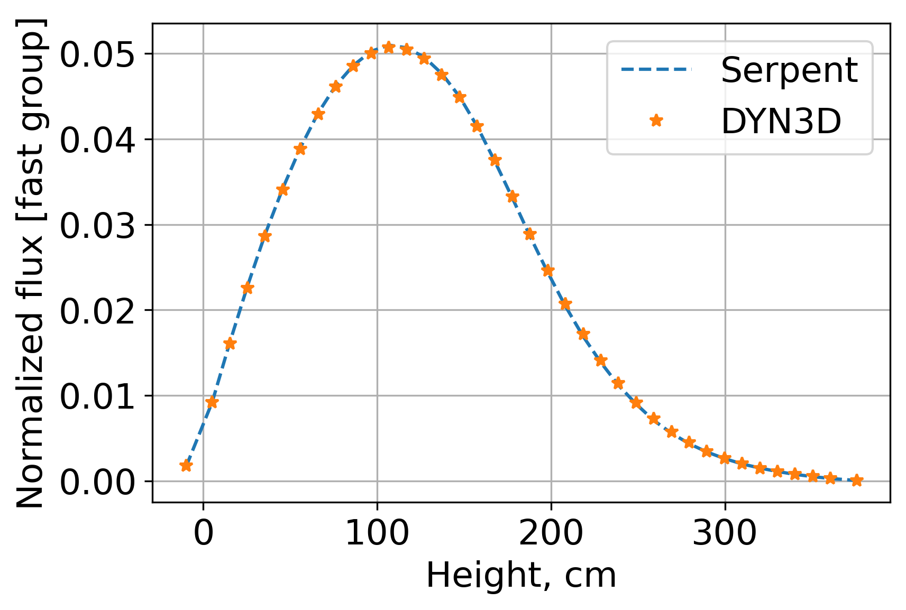

.. _new_example:

Execute DYN3D after reading & writing cross sections
====================================================

This Notebook demonestrates how to read cross sections from a serpent
``_res.m`` file, and write these cross sections using a template file.
In addition, this notebook shows how to execute DYN3D using the written
cross sections.

Case Description
----------------

The ``.\inputs`` directory includes: - ``bwr_rho1_2gr`` a serpent input
file. This is a 3D BWR assembly divided into 36 layers (i.e., universes
1,2,…,36) of fuel surrounded by a bottom (universe 54) and upper layers
(universe 55) of reflectors. - ``bwr_rho1_2gr_res.m`` a serpent results
file with all the cross sections. - ``univs`` a file that describes how
to read ``bwr_rho1_2gr_res.m`` - ``template_dyn3d_2g`` is a template
file that specifies how cross sections should be printed out. -
``controlDict`` the main files that is required by the ``xsInterface``.

The ``.\dyn3d`` includes a pre-generated DYN3D case. The ``.\dyn3d\xs``
directory will include all the files with printed cross sections
required by DYN3D.

Required imports
~~~~~~~~~~~~~~~~

.. code:: 

    from xsInterface.functions.main import Main

.. code:: 

    # a class required to execute DYN3D
    from xsInterface.functions.dyn3d import DYN3D

.. code:: 

    # plotting capability
    from xsInterface.functions.plotters import Plot1d

.. code:: 

    inputFile = ".\\inputs\\controlDict"

Read the cross sections
~~~~~~~~~~~~~~~~~~~~~~~

.. code:: 

    # Reset the main object
    xs = Main(inputFile)

.. parsed-literal::

    ... Reading control dict ...
    <.\inputs\controlDict>
    
    

Read xs data without populating the templates
^^^^^^^^^^^^^^^^^^^^^^^^^^^^^^^^^^^^^^^^^^^^^

.. code:: 

    # readTemplate allows to read and populate data using the templates
    xs.Read(readUniverses=True)

.. parsed-literal::

    SERPENT Serpent 2.1.32 found in .\inputs\bwr_rho1_2gr_res.m, but version 2.1.31 is defined in settings
      Attemping to read anyway. Please report strange behaviors/failures to developers.
    

.. parsed-literal::

    ... Reading universe <u> ...
    ... Reading coe/_res.m file for hisotry <nom> ...
    

Populate cross sections
~~~~~~~~~~~~~~~~~~~~~~~

In the ``".\\inputs\\controlDict"`` the user defined the core map used
to populate the cross sections according to their channels and layers
positions.

In our problem we have 1 channel and 38 axial layers.

**Define states** These states must exist and be used to obtain the
cross sections for different channels and layers.

.. code:: 

    nchs, nlayers = 1, 38
    states = {
    'history':[['nom']*nlayers]*nchs, 'time': [[0.0]*nlayers]*nchs, 'dens': [[700.]*nlayers]*nchs,}

**Populate core data** built-in capability to populate the data
according to the defined map including defining new variables not listed
in the original ``univs`` file. This is a **mandaory** step if the
intent is to execute DYN3D.

.. code:: 

    volmanip = {'infflx': 'divide'}
    xs.PopulateCoreData(
                        states=states, 
                        attributes=None,  # specify only if specific attrs needed
                        volManip=volmanip,
                        adf=None, topadf=None, bottomadf=None)

Execute DYN3D
~~~~~~~~~~~~~

.. code:: 

    casedir = ".\\dyn3d"   # dyn3d dir
    casefile = "bwr"  # name of dyn3d file
    exefile = "RUN_DYN3D" # dyn3d executuin file
    
    # Reset the object
    reslt = DYN3D(xs, casedir, casefile, exefile)

**Execute**

The files will be written to the specified directories and then
automatically executed.

.. code:: 

    reslt.Execute()

.. parsed-literal::

    
    
    ... Writing cross sections ...
    
    
    ... DYN3D Execution ... Start
    ... DYN3D Execution ... Ended Successfully
    

Process results
~~~~~~~~~~~~~~~

.. code:: 

    # eigenvalue
    reslt.keff

.. parsed-literal::

    1.358136

.. code:: 

    # few-group flux
    reslt.flux

.. parsed-literal::

    array([[[1.75756027e-03, 1.08768465e-03],
            [9.17626016e-03, 1.87150819e-03],
            [1.60580237e-02, 2.97127822e-03],
            [2.25582343e-02, 4.16427836e-03],
            [2.86026533e-02, 5.26059543e-03],
            [3.40548884e-02, 6.26368238e-03],
            [3.88372478e-02, 7.13383010e-03],
            [4.28772194e-02, 7.86240617e-03],
            [4.61091966e-02, 8.44768409e-03],
            [4.84934704e-02, 8.86376663e-03],
            [5.00024171e-02, 9.13827752e-03],
            [5.06619338e-02, 9.22114873e-03],
            [5.04288585e-02, 9.17108071e-03],
            [4.93601652e-02, 8.96044971e-03],
            [4.74886570e-02, 8.61515300e-03],
            [4.48523166e-02, 8.11447277e-03],
            [4.14960325e-02, 7.50675055e-03],
            [3.75423852e-02, 6.69875624e-03],
            [3.32365352e-02, 5.73365193e-03],
            [2.88529934e-02, 4.81343619e-03],
            [2.46162027e-02, 3.97091220e-03],
            [2.06953585e-02, 3.23543021e-03],
            [1.71750585e-02, 2.59490480e-03],
            [1.40812000e-02, 2.06487435e-03],
            [1.14224153e-02, 1.62634752e-03],
            [9.17108071e-03, 1.27069191e-03],
            [7.28921362e-03, 9.82369150e-04],
            [5.73883138e-03, 7.56199802e-04],
            [4.47677189e-03, 5.73192544e-04],
            [3.46332604e-03, 4.31620892e-04],
            [2.65533173e-03, 3.24578911e-04],
            [2.01480632e-03, 2.38254732e-04],
            [1.50722015e-03, 1.74374840e-04],
            [1.10322300e-03, 1.24306817e-04],
            [7.80370572e-04, 8.63241784e-05],
            [5.19671554e-04, 5.69739577e-05],
            [2.96955174e-04, 3.79826385e-05],
            [6.04269249e-05, 3.62561549e-05]]])

Compare results against Serpent
~~~~~~~~~~~~~~~~~~~~~~~~~~~~~~~

.. code:: 

    import numpy as np

The layers are defined as they were used in the actual problem

.. code:: 

    layers = np.linspace(0, 365.76, 37)  #active core
    layers = np.hstack((-20.0, layers, 385.76))  # with reflectors
    zmid = 0.5*(layers[0:-1] + layers[1:])

Built-in plotting capability to plot channels results

.. code:: 

    xs.ChannelsPlot('infflx', zmid, ylabel='Flux', xlabel='Height, cm', markers='--ro',
                    layers=np.linspace(1,30,30, dtype=int), markerfill=True)

**Reference** Serpent soslution

.. code:: 

    refFlx, chIds = xs.CoreValues('infflx', volManip=['divide'])
    refFlx = np.array(refFlx['infflx'])
    # normalize to unity
    refFlx = refFlx / refFlx.sum()

.. code:: 

    # flux obtained by DYN3D
    dynFlux = np.array(reslt.flux)
    dynFlux = dynFlux / dynFlux.sum()

.. code:: 

    dynFlux[0, :, 0]  # e.g., DYN3D flux [channel, layer, group]

.. parsed-literal::

    array([1.75756027e-03, 9.17626016e-03, 1.60580237e-02, 2.25582343e-02,
           2.86026533e-02, 3.40548884e-02, 3.88372478e-02, 4.28772194e-02,
           4.61091966e-02, 4.84934704e-02, 5.00024171e-02, 5.06619338e-02,
           5.04288585e-02, 4.93601652e-02, 4.74886570e-02, 4.48523166e-02,
           4.14960325e-02, 3.75423852e-02, 3.32365352e-02, 2.88529934e-02,
           2.46162027e-02, 2.06953585e-02, 1.71750585e-02, 1.40812000e-02,
           1.14224153e-02, 9.17108071e-03, 7.28921362e-03, 5.73883138e-03,
           4.47677189e-03, 3.46332604e-03, 2.65533173e-03, 2.01480632e-03,
           1.50722015e-03, 1.10322300e-03, 7.80370572e-04, 5.19671554e-04,
           2.96955174e-04, 6.04269249e-05])

.. code:: 

    flx_g1 = {'Serpent': refFlx[0, :, 0],  # fast flux
              'DYN3D': dynFlux[0, :, 0],}
    flx_g2 = {'Serpent': refFlx[0, :, 1],  # thermal flux
              'DYN3D': dynFlux[0, :, 1],}
    

Built-in 1-dim plotting capability

.. code:: 

    Plot1d(xvalues=zmid, yvalues=flx_g1,
           markers=['--', '*'],
           xlabel="Height, cm", ylabel="Normalized flux [fast group]")

.. code:: 

    Plot1d(xvalues=zmid, yvalues=flx_g2,
           markers=['--', '*'],
           xlabel="Height, cm", ylabel="Normalized flux [thermal group]")

Calculate the fast and thermal flux differences and plot these

.. code:: 

    perc_diff = 100*(1-dynFlux/refFlx)
    gr_diff = {'Fast': perc_diff[0, :, 0],  # fast flux
              'Thermal': perc_diff[0, :, 1],}  # thermal

.. code:: 

    Plot1d(xvalues=zmid, yvalues=gr_diff,
           markers=['^', '*'],
           xlabel="Height, cm", ylabel="DYN3D-Serpent flux percent difference [%]")

.. image:: exe_dyn3d_files/exe_dyn3d_43_0.png

